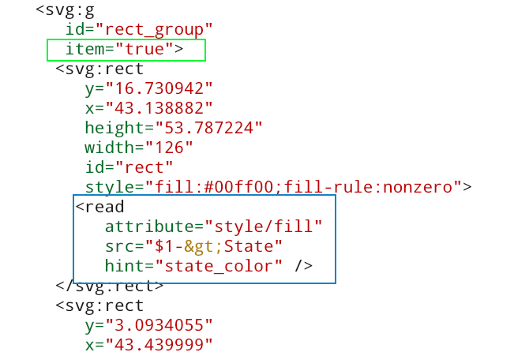

# cumbia svg library documentation

### Use Qt SVG module to show and animate SVG drawings
The <a href="https://doc.qt.io/qt-5/qtsvg-module.html">Qt SVG C++ module</a> provides functionality for handling SVG images. The *cumbia* engines and
infrastructures can be used to change any SVG element.
An *svg* node with the *item* attribute defined and not set to *false* is
rendered in a dedicated QuGraphicsSvgItem, an extension of
the Qt <a href="https://doc.qt.io/qt-5/qgraphicssvgitem.html">QGraphicsSvgItem</a>.
QuGraphicsSvgItem represents the "*item*" node and its children on a
<a href="https://doc.qt.io/qt-5/qgraphicsscene.html">QGraphicsScene</a>.

##### Classes
QuSvg (main class), QuDom (DOM representation), QuDomElement (QDomElement wrapper with
improved search and access functionality), QuGraphicsSvgItem (extends QGraphicsSvgItem),
QuSvgView (<a href="https://doc.qt.io/qt-5/qgraphicsscene.html">QGraphicsView</a>
extension that creates items, manages zoom operations, signals click and context
menu events).

### Accessing item properties
Items, that map the *nodes* defined in the *svg* DOM document, can be
accessed in a very simple fashion by means of their *id* within the *square brackets* operator
defined in the QuDom and QuDomElement classes. Slash ('/') separate *ids* can be
specified to traverse the DOM more efficiently through a hierarchical path.

```cpp
const QuDom* qudom = m_qusvg->quDom(); // m_qusvg is a reference to QuSvg
const QuDomElement root(*qudom);
root["ellipse/blue_circle"].a("style/fill", "#ffffff"); // white
root["lil_star"].a("style/fill", "#ff0000"); // red
```


##### Classes
QuDom, QuDomElement

### Connect with the Tango and Epics (and more...) control system software
SVG elements in the drawing can be *connected* to values obtained from the available *cumbia* engines and their properties changed accordingly.
In several cases, the connections defined and the type of attributes in the SVG elements allow for automatic changes in the representation of 
the object within the drawing. In more complex ones, the programmer will map values from the engines to values of the *attributes* in the SVG
DOM document.

| rect elements changing their colors according to a Tango state  | svg code to declare an item with a reader                     |
|  |  |

##### Classes
QuSvgConnectionsPool (readers pool), QuSvgReader (cumbia reader implementation for this module), QuSvgWriteActionProvider

### Helper application support
Helper applications can be defined by the *helper* attribute in any item. As an alternative, they can be deduced from the source connected to the element, if 
a single one is defined (and if the engine in use supports this feature, e.g. Tango does).

##### Classes
QuSvgHelperApplicationProvider, QuSvgReplaceWildcardHelperInterface

### Item event handling
Events on an item are notified by Qt *signals* emitted by the QuSvgView. This includes clicks
(left button and contextual menu events). Contextual
menus will by default provide access to *helper applications* (if defined) and
write operations.
Additional actions can be added to contextual menus.

#### Write operations
Clicks can target simple *write operations*, while contextual
menus can pop up dialogs specialised in performing more complex writings
(for example, write a scalar number or change a text value on the engine).

##### Classes
QuSvgItemHandler, QuSvgHelperApplicationProvider, QuSvgWriteActionProvider


### Layers
The library supports the svg *layer* nodes. The class QuSvgLayerHelper can be used
to test and change *layer visibility*. The class also notifies when *sources*
(readers) are hidden or shown again, so that the QuSvgConnectionsPool can pause the
readings linked to hidden elements. The *qusvgsynoptic* example shows how layers can
be managed with the QuSvgLayerHelper.

#### Classes
QuSvgLayerHelper, QuSvgView

## Installation

### Dependencies

The library relies on *PKGCONFIG* to find the needed dependencies, that are
- cumbia
- cumbia-qtcontrols
Please make sure that the PKG_CONFIG_PATH variable include the cumbia installation prefix, for instance:

> echo $PKG_CONFIG_PATH 
> /usr/local/epics/base-7.0.2/lib/pkgconfig:/usr/local/tango-9.3.3/lib64/pkgconfig:/usr/local/omniorb-4.2.3/lib/pkgconfig:/usr/local/zeromq-4.1.7/lib/pkgconfig:/usr/local/qwt-6.1.4/lib/pkgconfig:*/usr/local/cumbia-libs/lib/pkgconfig*


On the Qt side, these are the required modules:
- widgets
- xml
- svg
- opengl

### Download build and install

> git clone https://github.com/ELETTRA-SincrotroneTrieste/qumbia-svg.git
> cd qumbia-svg
> qmake && make && make install

### Options
You can either edit qumbia-svg.pri to change the *INSTALL_ROOT* installation prefix or pass the *INSTALL_ROOT=path/to/qumbia-svg* to qmake:

> qmake INSTALL_ROOT=/usr/local/qumbia-svg

#### Default prefix

The default prefix is */usr/local/cumbia-libs* (includes in */usr/local/cumbia-libs/include/qumbia-svg/*, libs in */usr/local/cumbia-libs/lib/* and so forth)

### Important advice

Please make sure the installation prefix is the same as that used for the *cumbia* library. This ensures proper library interoperability.

### Are you ready?
 
Start reading the <a href="html/index.html">cumbia svg library documentation</a>.

